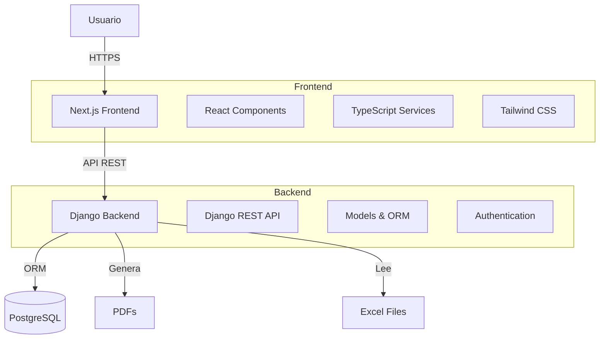

# Sistema Per Cápita FONASA

Bienvenido a la documentación oficial del Sistema de Gestión Per Cápita FONASA, una plataforma integral para la gestión y validación de usuarios inscritos en el sistema de salud per cápita.

## ¿Qué es el Sistema Per Cápita FONASA?

El Sistema Per Cápita FONASA es una aplicación web moderna diseñada para facilitar la gestión, validación y seguimiento de usuarios inscritos en centros de salud adscritos al sistema de financiamiento per cápita de FONASA.

## Características Principales

### 🔐 Gestión de Usuarios por Roles

El sistema implementa tres roles diferenciados con dashboards personalizados:

- **Administrador**: Control total del sistema, gestión de usuarios y acceso a logs
- **Informático**: Gestión de cortes FONASA y HP Trakcare
- **Administrativo**: Revisión y validación de usuarios

### 📊 Gestión de Cortes FONASA

- Carga masiva de archivos Excel con cortes mensuales
- Validación automática contra base de datos interna
- Historial completo de cargas mensuales
- Detección automática de duplicados por RUN

### 🏥 Integración HP Trakcare

- Importación de datos desde sistema HP Trakcare
- Búsqueda rápida de usuarios
- Sincronización con nuevos usuarios

### ✅ Validación de Usuarios

- Comparación automática entre fuentes de datos
- Estados de validación (VALIDADO, NO_VALIDADO, PENDIENTE, FALLECIDO)
- Sistema de observaciones para usuarios no validados
- Validación en lote

### 📁 Catálogos Maestros

Gestión completa de:

- Etnias
- Nacionalidades
- Sectores y subsectores
- Establecimientos de salud

### 🔍 Búsqueda Global

Sistema de búsqueda unificada con:

- Búsqueda en tiempo real con debouncing
- Resultados categorizados por módulo
- Atajo de teclado (Ctrl/Cmd + K)
- Navegación por teclado (↑↓ Enter)

### 📝 Sistema de Auditoría

Registro completo de todas las acciones:

- Tracking de IP y user agent
- 11 tipos de acciones diferentes
- 7 módulos del sistema
- Historial de cambios en formato JSON

### 🔔 Notificaciones en Tiempo Real

- Notificaciones push para usuarios
- 4 tipos: INFO, SUCCESS, WARNING, ERROR
- Auto-refresh cada 30 segundos
- Contador de notificaciones no leídas

### 📄 Reportes PDF

Generación profesional de reportes:

- Reporte de estadísticas generales
- Listado de usuarios con filtros
- Logs de auditoría
- Descarga directa desde el navegador

### 📈 Dashboards Personalizados

Cada rol tiene su propio dashboard con:

- Estadísticas relevantes
- Acciones rápidas
- Actividad reciente
- Tareas pendientes

## Tecnologías Utilizadas

### Backend

- **Django 5.1+**: Framework web robusto
- **Django REST Framework 3.15+**: API RESTful
- **PostgreSQL**: Base de datos relacional
- **ReportLab**: Generación de PDFs
- **openpyxl**: Procesamiento de archivos Excel

### Frontend

- **Next.js 16.0**: Framework React de última generación
- **React 19.2**: Biblioteca UI
- **TypeScript 5**: Tipado estático
- **Tailwind CSS 4**: Framework de estilos utility-first
- **shadcn/ui**: Componentes UI accesibles
- **Framer Motion**: Animaciones fluidas
- **Axios**: Cliente HTTP

## Arquitectura del Sistema

## Primeros Pasos

Para comenzar a usar el sistema, sigue nuestra guía de instalación:

1. [Instalación](getting-started/installation.md) - Configura tu entorno de desarrollo
2. [Configuración](getting-started/configuration.md) - Configura variables de entorno y base de datos
3. [Primer Uso](getting-started/first-steps.md) - Aprende los conceptos básicos

## Guías por Rol

Cada rol tiene su propia guía de usuario:

- [Guía del Administrador](user-guide/admin.md)
- [Guía del Informático](user-guide/informatico.md)
- [Guía del Administrativo](user-guide/administrativo.md)

## API de Backend

Documentación completa de todos los endpoints disponibles:

- [Autenticación](api/authentication.md)
- [Usuarios](api/endpoints/usuarios.md)
- [Cortes FONASA](api/endpoints/cortes.md)
- [Validaciones](api/endpoints/validaciones.md)
- [Auditoría](api/endpoints/auditoria.md)
- [Reportes](api/endpoints/reportes.md)

## Soporte

Si necesitas ayuda o tienes alguna pregunta:

- 📧 Email: [soporte@percapita.example.com](mailto:soporte@percapita.example.com)
- 📚 [FAQ](reference/faq.md)
- 🔧 [Solución de Problemas](reference/troubleshooting.md)

## Licencia

Este proyecto está bajo licencia privada. Todos los derechos reservados.

---

**Versión de la Documentación**: 1.0.0
**Última Actualización**: 2025-01-16
