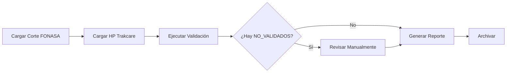

# Guía de Usuario

Bienvenido a la guía de usuario del Sistema Per Cápita FONASA.

## Selecciona tu Rol

El sistema está diseñado con tres roles diferenciados. Selecciona tu rol para ver la guía específica:

-   :fontawesome-solid-user-shield:{ .lg .middle } **Administrador**

    ---

    Acceso completo al sistema. Gestión de usuarios, configuración y auditoría.

    [:octicons-arrow-right-24: Ver guía](admin.md)

-   :fontawesome-solid-laptop-code:{ .lg .middle } **Informático**

    ---

    Gestión de cortes FONASA, HP Trakcare y validaciones de usuarios.

    [:octicons-arrow-right-24: Ver guía](informatico.md)

-   :fontawesome-solid-user-edit:{ .lg .middle } **Administrativo**

    ---

    Revisión y validación de usuarios inscritos en centros de salud.

    [:octicons-arrow-right-24: Ver guía](administrativo.md)

## Funcionalidades Comunes

Independiente de tu rol, todos los usuarios pueden:

### 🔍 Búsqueda Global

Busca cualquier cosa en el sistema con **Ctrl+K** (Windows/Linux) o **Cmd+K** (Mac):

- Usuarios
- Cortes FONASA
- HP Trakcare
- Establecimientos
- Y más...

[Más información sobre búsqueda](../features.md#busqueda-global)

### 🔔 Notificaciones

Recibe notificaciones en tiempo real:

- Información del sistema
- Confirmaciones de acciones
- Advertencias importantes
- Errores que requieren atención

Las notificaciones aparecen en el ícono de campana en la barra superior.

### 🔐 Seguridad

- Cambia tu contraseña regularmente
- Cierra sesión en computadores compartidos
- Reporta actividad sospechosa al administrador

### 📱 Interfaz Responsive

El sistema funciona en:

- Computadores de escritorio
- Tablets
- Teléfonos móviles

## Estructura del Sistema

### Navegación

**Sidebar (Barra Lateral)**:
- Dashboard
- Gestión de Datos
- Usuarios
- Validaciones
- Catálogos
- Administración (solo admin)

**Navbar (Barra Superior)**:
- Búsqueda global (Ctrl+K)
- Notificaciones
- Perfil de usuario
- Cerrar sesión

### Dashboards Personalizados

Cada rol tiene un dashboard diferente con:

- **Estadísticas relevantes**: Números y gráficos
- **Acciones rápidas**: Botones para tareas comunes
- **Actividad reciente**: Últimas acciones del sistema
- **Tareas pendientes**: Checklist de pendientes

## Conceptos Básicos

### Usuarios del Sistema vs Nuevos Usuarios

**Usuarios del Sistema**:
- Personal que opera la aplicación (tú y tus colegas)
- Tienen credenciales de login
- Tienen roles asignados (ADMIN, INFORMATICO, ADMINISTRATIVO)

**Nuevos Usuarios**:
- Personas inscritas en el sistema per cápita
- Datos provenientes de Excel
- Son validados contra FONASA

### Cortes FONASA

Archivos mensuales enviados por FONASA con usuarios validados para cada centro de salud.

### HP Trakcare

Sistema de gestión hospitalaria. Los datos se importan para comparar con cortes FONASA.

### Validación

Proceso de verificar que los datos de un usuario coincidan entre diferentes fuentes.

Estados:
- ✓ **VALIDADO**: Todo correcto
- ✗ **NO_VALIDADO**: Discrepancias encontradas
- ⏳ **PENDIENTE**: En revisión
- † **FALLECIDO**: Usuario fallecido

## Flujo de Trabajo Típico

1. **Informático** carga los archivos mensuales
2. Sistema ejecuta validación automática
3. **Administrativo** revisa casos NO_VALIDADOS
4. **Administrador** genera reportes y archiva

## Mejores Prácticas

### Para Todos los Usuarios

✓ Cambia tu contraseña cada 3 meses
✓ Verifica datos antes de guardar
✓ Usa la búsqueda global para encontrar cosas rápido
✓ Lee las notificaciones regularmente
✓ Reporta errores al administrador

### Para Informáticos

✓ Valida archivos Excel antes de cargar
✓ Carga cortes mensualmente sin falta
✓ Revisa errores inmediatamente después de cargar
✓ Mantén HP Trakcare actualizado

### Para Administrativos

✓ Revisa usuarios NO_VALIDADOS semanalmente
✓ Agrega observaciones detalladas
✓ No cambies estados sin justificación
✓ Marca usuarios como revisados después de verificar

### Para Administradores

✓ Revisa logs de auditoría regularmente
✓ Genera backups semanalmente
✓ Monitorea el espacio en disco
✓ Capacita a nuevos usuarios

## Atajos de Teclado

| Atajo | Función |
|-------|---------|
| <kbd>Ctrl</kbd>+<kbd>K</kbd> / <kbd>Cmd</kbd>+<kbd>K</kbd> | Abrir búsqueda global |
| <kbd>Esc</kbd> | Cerrar modal/diálogo |
| <kbd>↑</kbd> <kbd>↓</kbd> | Navegar en listas |
| <kbd>Enter</kbd> | Seleccionar/Confirmar |
| <kbd>Ctrl</kbd>+<kbd>S</kbd> / <kbd>Cmd</kbd>+<kbd>S</kbd> | Guardar formulario |

## Solución de Problemas Comunes

### No puedo iniciar sesión

1. Verifica que tu email sea correcto
2. Asegúrate de que Caps Lock esté desactivado
3. Si olvidaste la contraseña, contacta al administrador

### No veo mi centro de salud

Solicita al administrador que te asigne el centro.

### La búsqueda no encuentra nada

1. Verifica que escribiste bien (mínimo 2 caracteres)
2. Intenta con otro término de búsqueda
3. Verifica que tengas permisos para ver esos datos

### El archivo Excel no se carga

1. Verifica que el formato sea correcto
2. Revisa que todas las columnas requeridas existan
3. Asegúrate de que el archivo no esté corrupto

## Obtener Ayuda

Si necesitas ayuda:

1. **Busca en la documentación**
   - [FAQ](../reference/faq.md)
   - [Solución de Problemas](../reference/troubleshooting.md)

2. **Contacta Soporte**
   - 📧 Email: soporte@percapita.example.com
   - 📞 Teléfono: +56 2 XXXX XXXX

3. **Capacitación**
   - Solicita una sesión de capacitación al administrador

## Recursos Adicionales

- [Glosario de Términos](../reference/glossary.md)
- [Changelog](../reference/changelog.md)
- [API para Desarrolladores](../api/index.md)
